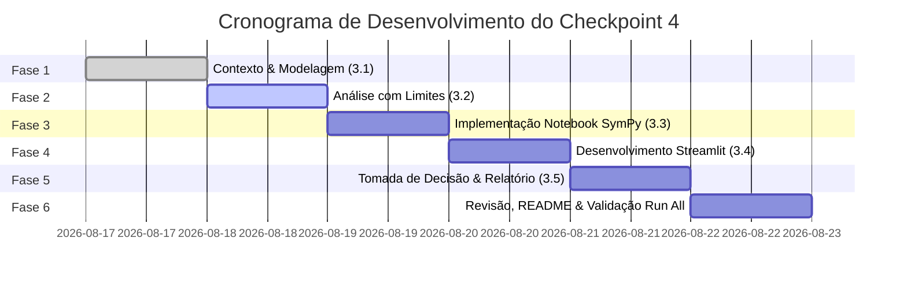

# 🗺️ Roadmap Detalhado — Checkpoint 4: Limites, Desempenho de APIs e Streamlit

**Disciplina:** Differentiated Problem Solving (DPS)  
**Instituição:** FIAP — 2026  
**Docente:** Prof. Jones Egydio  
**Tema:** Projeto Aplicado de Modelagem Matemática — *Da observação de desempenho à tomada de decisão técnica*  
**Pontuação Total:** 10,0 pontos  

---

## 📌 1. Visão Geral e Propósito

Este projeto tem como objetivo desenvolver um **modelo matemático e computacional** para investigar o comportamento do tempo de resposta (latência) de uma API conforme a taxa de requisições recebidas por segundo aumenta.

A entrega combina:
1. **Modelagem Matemática & Teoria de Limites:** Estudo do comportamento assintótico e pontos de saturação.
2. **Implementação Computacional (Python & SymPy):** Resolução simbólica, simulações numéricas e visualizações gráficas no Jupyter Notebook (`checkpoint.ipynb`).
3. **Aplicação Interativa (Streamlit):** Interface intuitiva (`app.py`) para exploração de cenários e apoio à tomada de decisão por gestores, arquitetos de software e SREs.
4. **Relatório Técnico e Decisão de Engenharia:** Conexão dos resultados com arquitetura de software, infraestrutura escalável, SLAs e *rate limiting*.

---

## 📁 2. Estrutura do Repositório e Entregáveis

```text
Limite-de-desempenho-de-API/
│
├── checkpoint.ipynb     # Notebook Jupyter principal (Relatório, matemática, códigos, gráficos e saídas)
├── app.py               # Aplicação web interativa desenvolvida com Streamlit
├── requirements.txt     # Dependências do projeto (streamlit, pandas, numpy, sympy, matplotlib, etc.)
├── README.md            # Instruções de instalação, execução, contexto da empresa e arquitetura
├── roadmap.md           # Planejamento e checklist detalhado de desenvolvimento
└── Checkpoint_4_DPS_Limites_Streamlit_GitHub.pdf # Documento original com as diretrizes
```

---

## 🧮 3. Fundamentação do Modelo Matemático

### 3.1. Dados Empíricos do Teste de Carga
| Carga ($x$ em req/s) | Tempo Médio de Resposta ($f(x)$ em ms) | Dedução Analítica |
| :---: | :---: | :---: |
| **10** | 25 | $\frac{1000}{50 - 10} = \frac{1000}{40} = 25$ |
| **20** | 33 | $\frac{1000}{50 - 20} = \frac{1000}{30} \approx 33.33$ |
| **30** | 50 | $\frac{1000}{50 - 30} = \frac{1000}{20} = 50$ |
| **35** | 67 | $\frac{1000}{50 - 35} = \frac{1000}{15} \approx 66.67$ |
| **40** | 100 | $\frac{1000}{50 - 40} = \frac{1000}{10} = 100$ |
| **45** | 200 | $\frac{1000}{50 - 45} = \frac{1000}{5} = 200$ |
| **48** | 500 | $\frac{1000}{50 - 48} = \frac{1000}{2} = 500$ |

### 3.2. Função Matemática Adotada
A curva observada segue o modelo clássico de **Teoria de Filas $M/M/1$** (Tempo de permanência em sistema com um servidor e chegadas/atendimentos markovianos):

$$f(x) = \frac{1000}{50 - x}$$

- **Variável Independente ($x$):** Taxa de requisições por segundo ($\text{req/s}$).
- **Variável Dependente ($f(x)$):** Tempo médio de resposta da API em milissegundos ($\text{ms}$).
- **Constante $1000$:** Tempo de serviço intrínseco / fator de escalonamento.
- **Constante $50$:** Capacidade máxima teórica de processamento ($\mu = 50\text{ req/s}$).
- **Domínio Matemático:** $\text{Dom}(f) = \{x \in \mathbb{R} \mid x \neq 50\}$.
- **Domínio Operacional / Realista:** $x \in [0, 50)$ $\text{req/s}$.

---

## 🚀 4. Fases Detalhadas do Roadmap



---

### 📍 Fase 1: Construção e Justificativa do Modelo Matemático (Critério 3.1 — 2,0 pts)
- [ ] **1.1. Contexto do Negócio:**
  - Descrever a API da empresa do Challenge (ex.: microsserviço de autenticação/dados em nuvem *vivoCloud* da *Jovi*).
  - Justificar a importância da latência e dos impactos de indisponibilidade para clientes e SLAs.
- [ ] **1.2. Definição Formal de Variáveis e Domínios:**
  - Especificar variável dependente ($T(x)$ em ms) e independente ($x$ em req/s).
  - Formalizar o domínio estritamente matemático vs. o domínio operacional viável ($0 \le x < 50$).
- [ ] **1.3. Justificativa da Escolha da Função Racional:**
  - Explicar por que funções lineares ou polinomiais não refletem o enfileiramento e por que uma função racional assintótica representa a saturação de buffers e conexões.
- [ ] **1.4. Identificação do Ponto Crítico:**
  - Definir o ponto $x = 50\text{ req/s}$ como o ponto crítico onde o sistema atinge sua assíntota vertical.
- [ ] **1.5. Resposta à Questão Obrigatória 3.1:**
  - *A capacidade estimada de 50 req/s significa necessariamente que o sistema consegue operar normalmente com exatamente 50 req/s?*
  - **Resposta técnica:** Não. Em $x = 50$, o denominador anula-se ($50 - 50 = 0$), levando a latência a $+\infty$. Na prática, significa esgotamento de *threads*, saturação de CPU/memória, estouro de conexões e *timeouts* generalizados.

---

### 📍 Fase 2: Análise Matemática Utilizando Limites (Critério 3.2 — 2,0 pts)
- [ ] **2.1. Cálculo Formal dos Limites:**
  - **Latência Base em Repouso:**
    $$\lim_{x \to 0^+} \frac{1000}{50 - x} = 20\text{ ms}$$
  - **Saturação e Colapso (Aproximação pela esquerda):**
    $$\lim_{x \to 50^-} \frac{1000}{50 - x} = +\infty$$
  - **Região Além da Capacidade (Aproximação pela direita):**
    $$\lim_{x \to 50^+} \frac{1000}{50 - x} = -\infty \quad (\text{sem sentido físico})$$
  - **Limite no Infinito:**
    $$\lim_{x \to \infty} \frac{1000}{50 - x} = 0$$
- [ ] **2.2. Classificação de Descontinuidades e Assíntotas:**
  - Identificar a descontinuidade infinita (não-removível) em $x = 50$.
  - Formalizar a existência da **assíntota vertical** na reta $x = 50$.
- [ ] **2.3. Diferenciação entre Domínio Matemático e Operacional:**
  - Explicar que valores como $x > 50$ ou $x < 0$ são algebricamente calculáveis, mas fisicamente inválidos no mundo real da computação.
- [ ] **2.4. Resposta à Questão Obrigatória 3.2:**
  - *Qual é o significado operacional de uma assíntota vertical em um modelo de desempenho de software?*
  - **Resposta técnica:** Representa o limiar intransponível de capacidade do hardware/software, onde a taxa de chegada é igual ou superior à taxa de atendimento, tornando o tempo de espera no buffer infinito (*infinite queuing delay*).

---

### 📍 Fase 3: Implementação Computacional no Jupyter Notebook (Critério 3.3 — 2,0 pts)
- [ ] **3.1. Configuração do Ambiente e Bibliotecas:**
  - Importar `sympy`, `numpy`, `pandas`, `matplotlib.pyplot` e `seaborn`.
- [ ] **3.2. Resolução Simbólica com SymPy:**
  - Definir símbolo e função: `x = sp.Symbol('x')`, `f = 1000 / (50 - x)`.
  - Executar cálculos simbólicos de limites via `sp.limit()`.
- [ ] **3.3. Tabela Numérica de Simulação Obrigatória:**
  - Calcular e exibir os valores exatos de $f(x)$ para as cargas:
    $$[10,\ 20,\ 30,\ 40,\ 45,\ 48,\ 49,\ 49.5,\ 49.9]$$
  - Apresentar em DataFrame formatado e analisar o crescimento hiperbólico.
- [ ] **3.4. Gráficos de Alta Qualidade:**
  - Plotar a curva de latência contínua.
  - Adicionar a linha vertical tracejada vermelha na assíntota $x = 50$.
  - Plotar os pontos experimentais coletados.
  - Inserir faixas de cores/zonas de operação (Verde: Segura $< 35$; Amarela: Atenção $35-45$; Vermelha: Crítica $> 45$).
  - Identificar eixos com grandezas e unidades claras ($x\text{ [req/s]}$, $y\text{ [ms]}$).
- [ ] **3.5. Resposta à Investigação Computacional 3.3:**
  - *O que os valores numéricos parecem indicar quando a carga se aproxima da capacidade crítica? Como se relaciona com o limite simbólico?*

---

### 📍 Fase 4: Aplicação Interativa em Streamlit (Critério 3.4 — 2,0 pts)
- [ ] **4.1. Estruturação do Arquivo `app.py`:**
  - Utilizar a mágica `%%writefile app.py` no próprio notebook para manter coerência total de código.
- [ ] **4.2. Interface do Usuário (UI/UX):**
  - **Título e Apresentação:** Explicação clara do problema, modelo matemático e parâmetros da infraestrutura.
  - **Controles Interativos:**
    - `st.slider` para ajuste fino de carga ($0.0$ a $49.9$ req/s).
    - `st.number_input` ou caixa de cenário para testes rápidos.
    - Seletor de SLA de Latência alvo (ex.: 100 ms, 200 ms, 500 ms).
  - **Métricas Visuais:**
    - Cartões com `st.metric` exibindo Tempo de Resposta Previsto, Taxa de Ocupação da API ($\%$) e Variação vs. Carga Base.
  - **Alertas Dinâmicos:**
    - `st.success` (Operação Estável / SLA Cumprido);
    - `st.warning` (Alerta de Degradação / Próximo ao limite seguro);
    - `st.error` (Violação Crítica de SLA / Risco iminente de colapso).
  - **Gráfico Interativo:**
    - Gráfico gerado via Plotly ou Matplotlib marcando exatamente o ponto atual selecionado pelo usuário sobre a curva e a proximidade da assíntota.
- [ ] **4.3. Resposta à Questão Obrigatória 3.4:**
  - *Como a aplicação transforma o resultado matemático em uma informação útil para uma pessoa responsável por operação, arquitetura ou infraestrutura de software?*
  - **Resposta técnica:** Converte fórmulas abstratas em *dashboards* operacionais intuitivos, permitindo que SREs e arquitetos simulem picos de tráfego, planejem capacidade (*capacity planning*) e estabeleçam gatilhos precisos para *autoscaling* e alarmes de monitoramento.

---

### 📍 Fase 5: Notebook Técnico, Interpretação e Tomada de Decisão (Critério 3.5 — 2,0 pts)
- [ ] **5.1. Análise de Saturação e Capacidade Operacional:**
  - Caracterizar formalmente o comportamento matemático de saturação (curvatura e aceleração da derivada / explosão assintótica).
  - Delimitar a **Zona Segura de Operação** ($x \le 35\text{ req/s}$ ou $70\%$ da capacidade nominal).
  - Explicar o perigo de operar entre $40$ e $48\text{ req/s}$ (pequenas flutuações geram variações brutais de latência).
- [ ] **5.2. Recomendações Técnicas de Engenharia de Software:**
  1. **Escalabilidade Horizontal:** Adicionar nós adicionais via *Kubernetes Horizontal Pod Autoscaler* (HPA) quando $x \ge 35\text{ req/s}$ por nó.
  2. **Load Balancer:** Configurar balanceadores (NGINX, AWS ALB) com algoritmo *Least Connections* ou *Round Robin*.
  3. **Rate Limiting & Throttling:** Implementar controle de taxa com algoritmos *Token Bucket* ou *Leaky Bucket*, retornando status `HTTP 429 Too Many Requests` para requisições excedentes.
  4. **Camada de Caching:** Integrar cache em memória (Redis/Memcached) e CDN (Cloudflare) para evitar processamentos redundantes no backend.
  5. **Filas Assíncronas:** Desacoplar operações pesadas utilizando RabbitMQ, Kafka ou AWS SQS.
  6. **Circuit Breaker:** Implementar padrão de resiliência para interromper chamadas e degradar graciosamente o serviço antes do colapso total.
- [ ] **5.3. Limitações do Modelo e Próximos Passos:**
  - Discutir que o modelo racional $M/M/1$ é simplificado (assume requisições com tempo de processamento determinístico, infraestrutura mono-thread e ausência de contenção de banco de dados/rede externa).
  - Sugerir coleta de dados estocásticos (percentis p95, p99) e testes de estresse distribuídos (k6, Locust, JMeter).

---

### 📍 Fase 6: Padronização, Testes, README e Entrega GitHub
- [ ] **6.1. Execução Completa do Notebook:**
  - Executar `Restart & Run All` para garantir que o notebook roda sequencialmente do início ao fim sem erros e com todas as saídas e gráficos gravados no arquivo `.ipynb`.
- [ ] **6.2. Criação e Teste do `requirements.txt`:**
  - Garantir compatibilidade de pacotes:
    ```text
    streamlit>=1.28.0
    pandas>=2.0.0
    numpy>=1.24.0
    sympy>=1.12
    matplotlib>=3.7.0
    seaborn>=0.12.0
    plotly>=5.15.0
    ```
- [ ] **6.3. Atualização do `README.md`:**
  - Contextualização do projeto e membros do grupo.
  - Passo a passo para execução do notebook e inicialização do Streamlit (`streamlit run app.py`).
  - Resumo das conclusões técnicas e link do deploy no Streamlit Cloud (opcional).
- [ ] **6.4. Verificação de Git / GitHub:**
  - Realizar commit e push de todos os arquivos organizados.
  - Garantir que o repositório esteja público ou com acesso concedido ao docente.

---

## 📋 5. Matriz de Rastreabilidade e Critérios de Avaliação

| Item | Critério do Edital | Onde está documentado | Pontuação |
| :---: | :--- | :--- | :---: |
| **1** | **Construção do Modelo Matemático** (Variáveis, domínios, dedução da função racional, justificativa e questão obrigatória) | `checkpoint.ipynb` (Seção 1) | **2,0** |
| **2** | **Análise Matemática com Limites** (Cálculo de limites laterais, assíntota vertical, interpretação física e questão obrigatória) | `checkpoint.ipynb` (Seção 2) | **2,0** |
| **3** | **Implementação Computacional** (SymPy, tabela com cargas obrigatórias até 49.9, gráficos com legendas e eixos) | `checkpoint.ipynb` (Seção 3) | **2,0** |
| **4** | **Aplicação Interativa Streamlit** (Slider, cálculo dinâmico, visualização gráfica, SLA, alertas e questão obrigatória) | `app.py` & `checkpoint.ipynb` (Seção 4) | **2,0** |
| **5** | **Notebook Técnico e Tomada de Decisão** (Interpretação, capacidade segura vs teórica, recomendações de arquitetura e limitações) | `checkpoint.ipynb` (Seção 5) | **2,0** |
| **Total** | | | **10,0** |

---

## ⚠️ 6. Checklist de Prevenção de Falhas (Anti-Penalidades)

- [x] O notebook é **autossuficiente** (contém relatório, equações LaTeX, código e gráficos juntos).
- [x] A função matemática utilizada no `checkpoint.ipynb` e no `app.py` é **exatamente a mesma** ($f(x) = \frac{1000}{50 - x}$).
- [x] Todas as simulações obrigatórias ($10, 20, 30, 40, 45, 48, 49, 49.5, 49.9$) estão presentes na tabela e no gráfico.
- [x] Todos os gráficos possuem título, eixos identificados com unidades ($\text{req/s}$, $\text{ms}$) e linhas de referência.
- [x] Todas as questões obrigatórias (3.1, 3.2, 3.4 e 3.5) possuem respostas explícitas e aprofundadas.
- [x] O comando para executar a aplicação Streamlit (`streamlit run app.py`) está destacado no notebook e no `README.md`.
- [x] As saídas do notebook estão todas salvas e visíveis sem necessidade de reexecução imediata pelo avaliador.

---

*Roadmap elaborado para guiar o desenvolvimento e garantir nota máxima (10,0) no Checkpoint 4 de Differentiated Problem Solving.*
